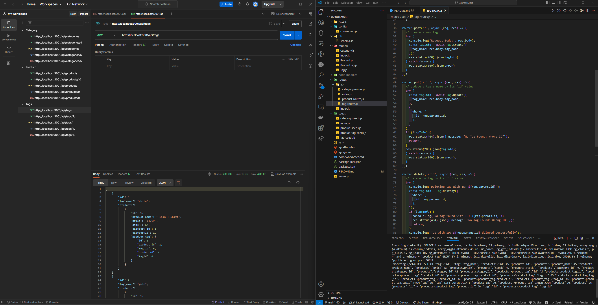

# Express-Mart

## Table of Contents

* [Description](#description)
* [Languages](#languages)
* [Features](#features)
* [Usage](#usage)
* [License](#license)  

## Description

 E-commerce backend that uses Express, Sequelize to interact with a PostgreSQL database. 

## Languages

* 
* 

## Features

* **Product Management:** Allows CRUD operations (Create, Read, Update, Delete) for products, including adding new products, updating existing ones, and deleting them.
* **Category Management:** Enables CRUD operations for product categories, allowing users to add, view, update, and delete categories.
* **Tagging System:** Supports tagging products with multiple tags for better organization and searchability.
* **Database Integration:** Uses Sequelize ORM for database management, ensuring efficient data storage and retrieval operations.

## Usage

* npm install to load all necessary packages if running locally, hosting on port 3001.
* npm start or node server.js will launch the server.

* [ExpressMart Repo ](https://github.com/IVIonsters/ExpressMart)
* Video Thumbnail - [Click to Watch ⇩⇩](https://drive.google.com/file/d/1bBuWVku74mv3y-5hRF8bAEabIPc9ndNk/view?usp=sharing)

* 

## License

